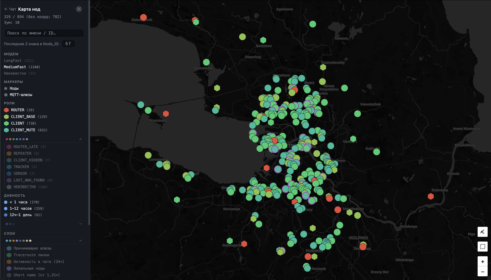
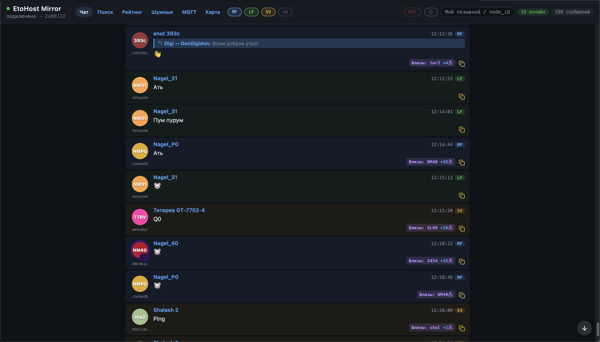
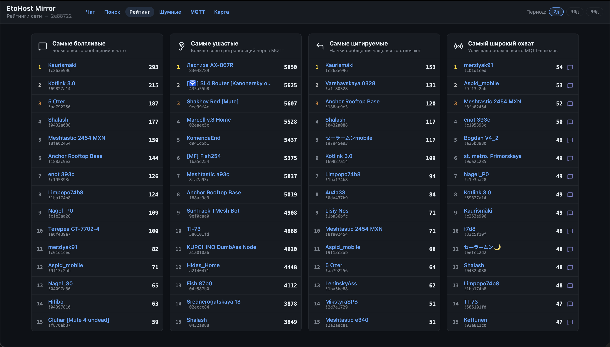
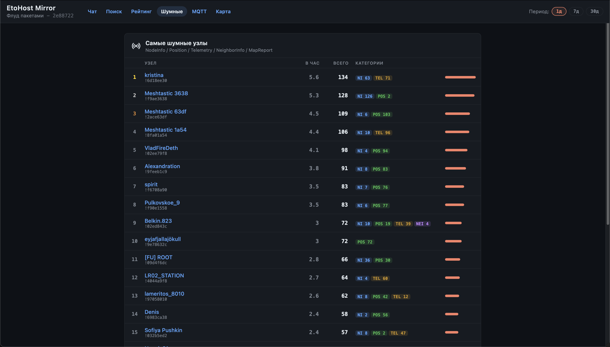
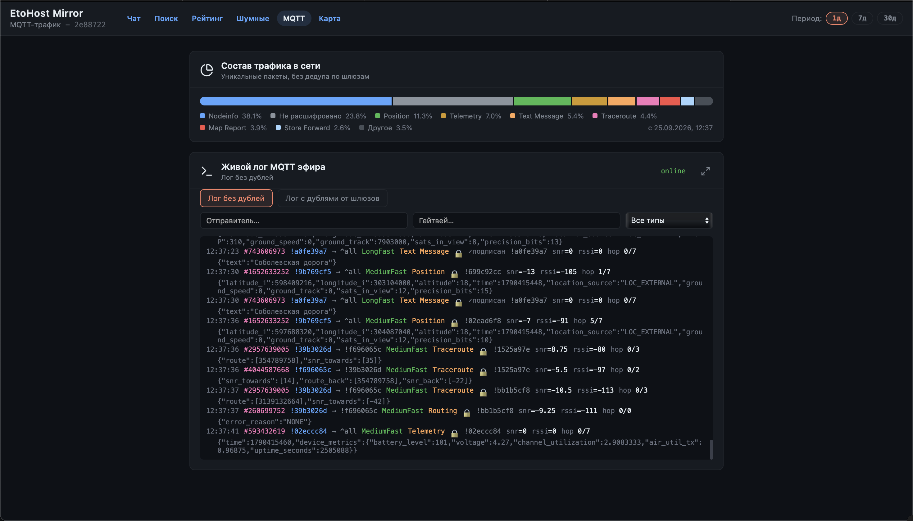
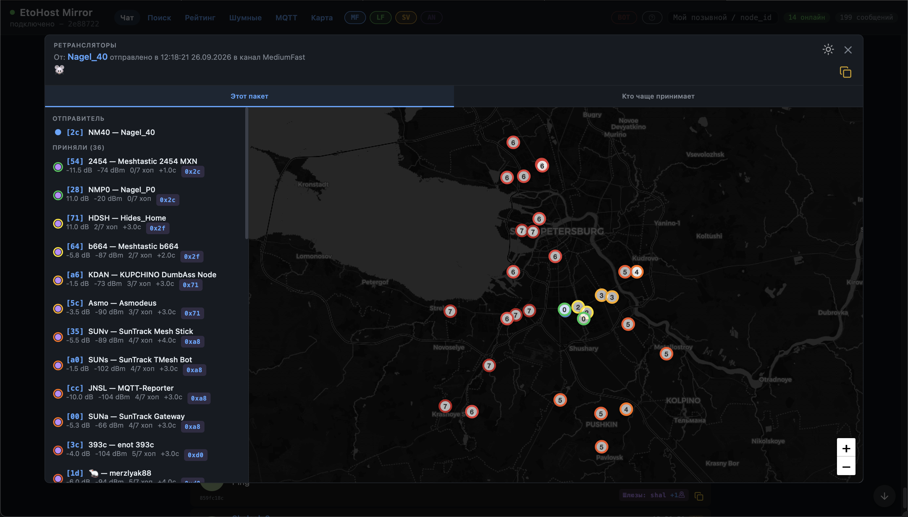

# OneMesh Mirror

Веб-платформа для мониторинга и взаимодействия с LoRa mesh-сетью [Meshtastic](https://meshtastic.org/) в Санкт-Петербурге и области (сеть **OneMesh**, канал `msh/RU/SPB`).

Проект слушает трафик mesh-сети через MQTT, декодирует протобаф-пакеты прошивки Meshtastic, сохраняет данные в базу и отдаёт их через веб-интерфейс в реальном времени: карта узлов, живой чат, лидерборды, traceroute-графы, а также публичное API для сторонних интеграций. Отдельный бот обслуживает служебный канал сети, отвечая на команды как по радио, так и через веб-сокет мониторинга.

> 🔒 Репозиторий с кодом является приватным и находится в активной разработке. Здесь публикуется описание проекта, скриншоты и ссылка на рабочее демо. Публикация исходного кода в отдельном открытом репозитории планируется отдельно, после предварительной подготовки.

## Демо

**[🌐 mirror.etohost.ru](https://mirror.etohost.ru)** — рабочий инстанс, живые данные сети OneMesh SPB

## Скриншоты

| Карта узлов | Живой чат |
|---|---|
|  |  |

| Лидерборд | Антирейтинг |
|---|---|
|  |  |

| MQTT-лог | Шлюзы |
|---|---|
|  |  |

---

## Состав проекта

| Компонент | Назначение |
|---|---|
| **mesh-mirror-v2** | Backend (FastAPI) + Frontend (Vue 3 SPA) — приём MQTT-трафика сети, хранение данных, REST/WebSocket API, веб-интерфейс мониторинга |
| **mesh-bot** | Сервисный бот, работающий на служебном канале mesh-сети: отвечает на команды по радио и через WebSocket-фид mirror'а |

---

## mesh-mirror-v2

### Функциональность

- Приём и декодирование пакетов Meshtastic (protobuf) из MQTT-трафика сети
- Хранение узлов, сообщений, телеметрии, traceroute-цепочек, координат и истории позиций
- Живой чат по каналам сети с realtime-обновлениями
- Интерактивная карта узлов (Leaflet)
- Лидерборды и антилидерборды активности
- Визуализация traceroute-связей между узлами (relay graph)
- Панель live-просмотра сырого MQTT-трафика (для отладки/аналитики)
- Админ-панель (модерация, фильтры, управление контентом)
- Публичное партнёрское REST API (`/integration`) с версионированным, зафиксированным контрактом
- Полное протоколирование трафика сети в ClickHouse для аналитики (опционально, отдельно от основного пайплайна)

### Технологический стек

**Backend**
- Python 3.14, FastAPI, Uvicorn
- SQLAlchemy 2 + Alembic (миграции), asyncpg (async) / psycopg2 (для Alembic)
- PostgreSQL 16 — основное хранилище
- Redis 7 — кэш и pub/sub для realtime-рассылки
- ClickHouse — хранилище полного MQTT-трафика для аналитики
- aiomqtt — асинхронный MQTT-клиент
- protobuf, локально собранные протобафы Meshtastic (актуальнее пакета `meshtastic` из PyPI)
- pydantic-settings — типизированная конфигурация
- pytest / pytest-asyncio — тесты, включая контрактные тесты API

**Frontend**
- Vue 3 (TypeScript) + Vite
- Pinia — управление состоянием
- Vue Router
- Leaflet — карта узлов
- `@lucide/vue` — иконки
- `openapi-typescript` — генерация типов API из OpenAPI-схемы backend'а
- Vitest — юнит-тесты
- Два независимых сборочных таргета: realtime-транспорт на WebSocket или Server-Sent Events (для деплоя за прокси без поддержки WS)

**Инфраструктура**
- Docker / docker-compose (backend, mqtt-listener'ы, миграции — единый образ с разными командами запуска)
- nginx — раздача SPA и реверс-прокси перед API
- GitHub Actions — CI/CD

### Архитектура

```
Внешний MQTT-брокер (msh/RU/SPB/#)
        │
        ▼
mqtt-listener(-ы)  →  декодирование protobuf  →  обработчики по типу пакета
        │                                              │
        ▼                                              ▼
   PostgreSQL                                    ClickHouse (аналитика)
   (узлы, сообщения, телеметрия, traceroute...)
        │
        ▼
   Redis pub/sub (realtime-шина)
        │
        ▼
FastAPI web-сервис
  - REST-роутеры (чат, узлы, лидерборды, traceroute, админка...)
  - отдельное публичное integration API (Bearer-auth, зафиксированный контракт)
  - WebSocket-менеджер, транслирующий события из Redis браузерам
  - раздача собранного Vue SPA
        │
        ▼
Vue 3 SPA — карта, чат, лидерборды, typed API-клиент
```

### Паттерны и подходы

- **Слоистая архитектура backend**: чёткое разделение data-access (`db/`), бизнес-логики (`services/`), HTTP-слоя (`web/routers/`) и слоя приёма данных (`mqtt/handlers/`)
- **Реестр обработчиков** для диспетчеризации MQTT-пакетов по типу порта
- **Типобезопасность фронтенда** через автогенерацию TypeScript-типов из OpenAPI-схемы backend'а
- **Realtime fan-out через Redis pub/sub** вместо прямого polling
- **Двойная сборка фронтенда** (WebSocket / SSE) из единой кодовой базы через абстракцию транспорта
- **Alembic-миграции** с practice периодической "квадратизации" истории миграций
- **Декоратор устойчивости кэша** — единая точка обработки сбоев Redis без дублирования try/except

---

## mesh-bot

### Функциональность

Сервисный бот, работающий на выделенном канале mesh-сети. Отвечает на команды пользователей как принятые напрямую по радио (через подключённый Meshtastic-узел), так и присланные через WebSocket-фид mesh-mirror-v2 (для пользователей вне зоны радиоприёма). Ответы всегда отправляются по радио, чтобы их подхватили MQTT-шлюзы и mirror.

Команды: прогноз погоды, курсы валют, ping, информация об узле, лидерборд, время восхода/заката, ранг пользователя, статистика сообщений, модерация, справка и др.

### Технологический стек

- Python, библиотека `meshtastic` — коммуникация с радио-узлом
- `websockets` — подключение к realtime-фиду mesh-mirror-v2
- `asyncpg` — доступ к PostgreSQL
- `aiohttp` / `requests` — обращения к внешним API (погода, курсы валют)
- systemd — деплой как системный сервис с watchdog/heartbeat

### Архитектура и подходы

- **Два независимых транспорта команд**: прямой радио-канал (serial/TCP/`meshtasticd`) и WebSocket-подписка на mirror, объединённые единым диспетчером команд
- **Реестр команд через декоратор** (`@command(...)`) — новая команда добавляется файлом и одной строкой импорта
- **Outbox-паттерн** — исходящие ответы ставятся в очередь с ретраями и rate-limiting, отвязывая обработчики команд от деталей транспорта
- **Watchdog / systemd heartbeat** для отказоустойчивости сервиса

---

## Статус

Проект в активной разработке и эксплуатации, обслуживает реальную mesh-сеть OneMesh. Публикация исходного кода в открытый репозиторий запланирована после предварительной подготовки (очистка секретов, конфигов, документации).
